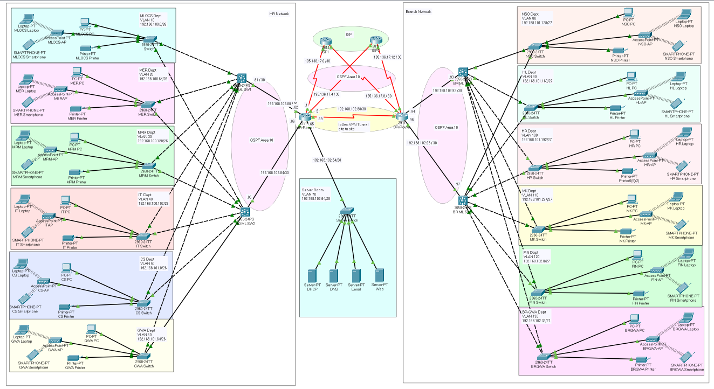
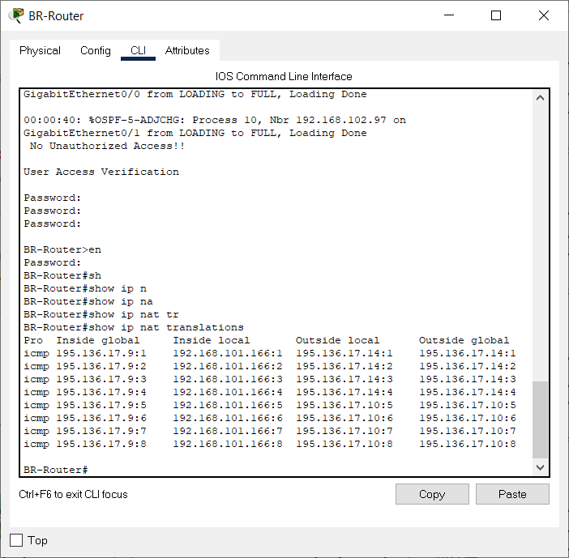
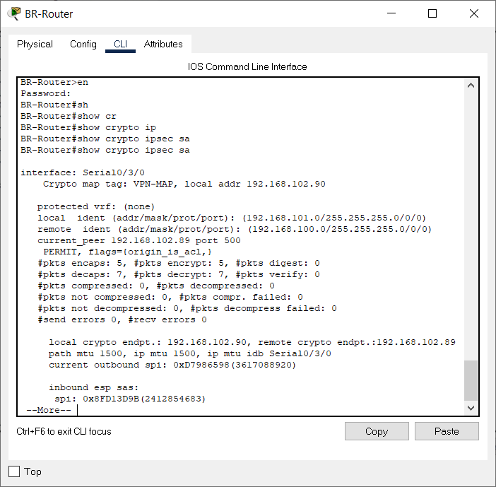

# Hospital System Enterprise Network Design

This project implements a network topology for a hospital system using Cisco Packet Tracer. The network design follows a hierarchical approach to ensure scalability and ease of management. It includes various technologies such as VLANs, subnetting, inter-VLAN routing, DHCP, SSH, OSPF, NAT, IPsec VPN, Access Control Lists, switchport security, and wireless networking.

## Network Topology

The network topology consists of the following components:

1. **HQ (Headquarters):** The main hub of the hospital system where core services are located.

2. **BR (Branch):** Represents branch locations or remote clinics that are connected to the headquarters.

3. **ISP1 and ISP2:** Internet Service Providers that provide internet connectivity to the network.

4. **Hospital Devices:** Include PCs, printers, and other devices used within the hospital network.

## Technologies Implemented

- Hierarchical Network Design with core, distribution, and access layers.
- VLANs and Inter-VLAN Routing to logically segregate the network and enable communication between VLANs.
- Subnetting and IP Addressing for efficient IP allocation.
- Configured DHCP Server to provide dynamic IP addresses to devices.
- SSH for secure remote access to networking devices.
- OSPF as the routing protocol for dynamic routing.
- NAT Overload (Port Address Translation PAT) for internet access.
- Site-to-Site IPsec VPN for secure communication between HQ and BR.
- Standard and Extended Access Control Lists (ACLs) for traffic filtering.
- Switchport Security (Port-Security) to prevent unauthorized access to switches.
- Configured Wireless Network using Cisco Access Point.

## Verification Results

1. Checking connection from HQ PC to ISP1 and ISP2:

   

2. Checking connection from BR PC to ISP1 and ISP2:

   

3. Checking connection from HQ PC to BR PC:

   

4. Network Address Translation (NAT) configuration:

   

5. Site-to-Site VPN Verification:

   

## How to Run the Network (For Simulation)

1. Install Cisco Packet Tracer on your computer.

2. Open the Packet Tracer project file containing the network topology.

3. Start the simulation to test and verify the network communication.

## Authors

- [Your Name]

## Acknowledgments

Special thanks to [Instructor/Supervisor Name] for guidance and support throughout the project.

